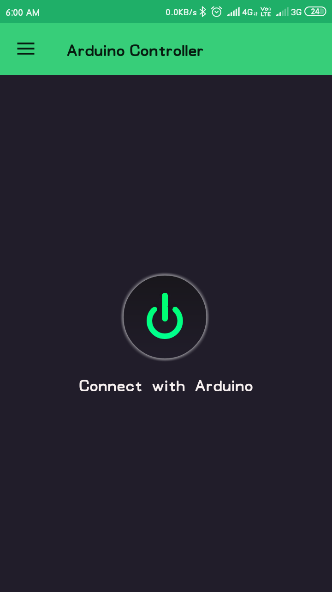
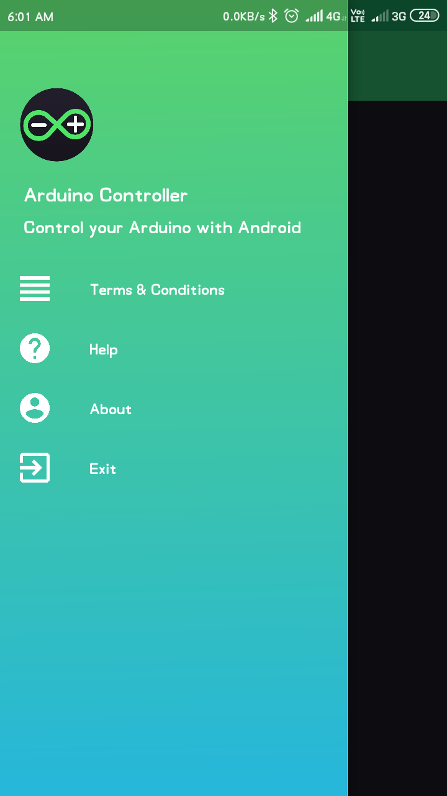
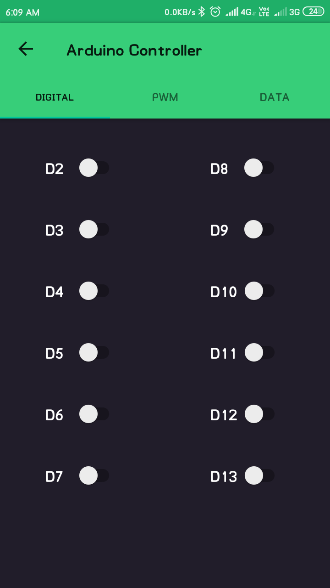
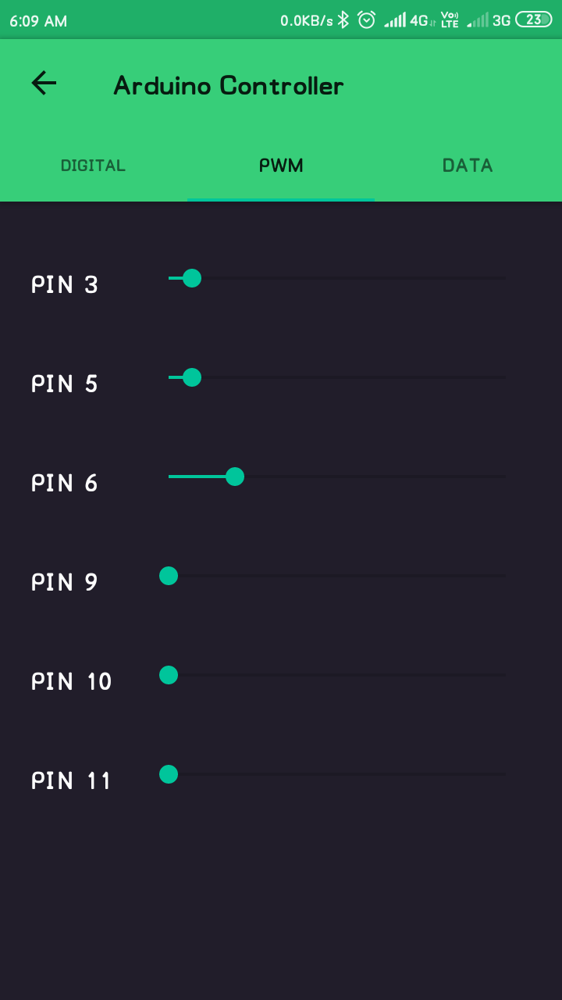
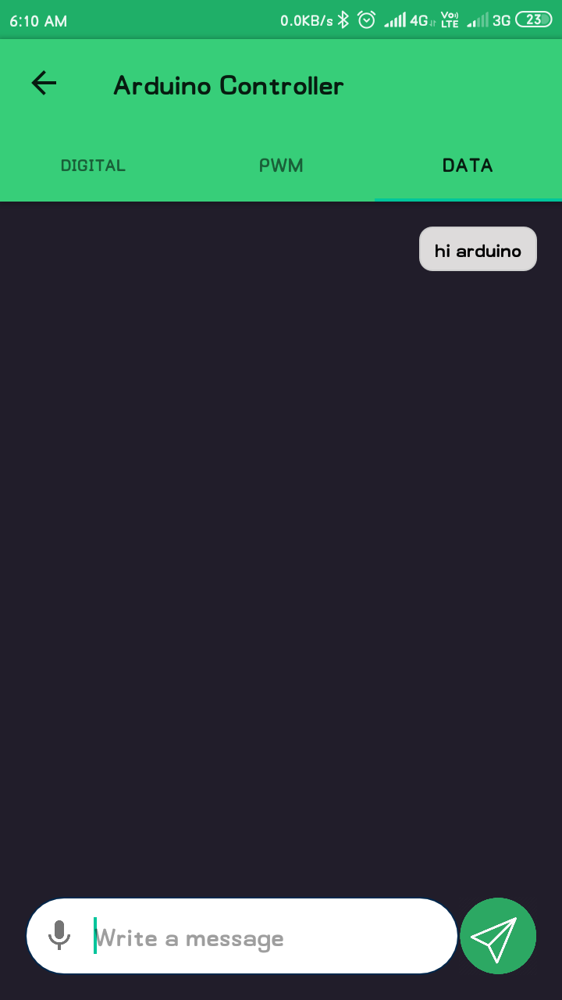

# Arduino-Controller

Arduino controller is a simple app to demonastrate the making connection and control the Arduino uno through the HC-05/HC-06/any bluetooth shield.

# Here are some screenshots

